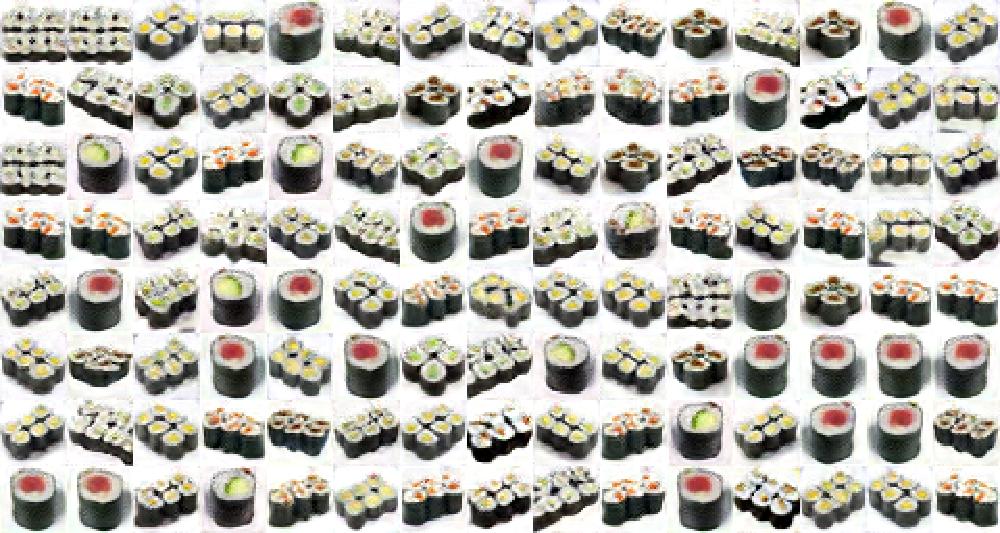

# Sushi classification & generation

Machine learning models for sushi classification & generation (50 classes).

Dataset ["Sushi-50 - A dataset from Jianing Qiu et al [28/12/2020]"](https://homepages.inf.ed.ac.uk/rbf/CVonline/Imagedbase.htm)

To see resutlts and generate/classify sushis [click here](https://paulbarza.github.io/Website/sushi.html). 

## Classification

### Deep learning

Fine-tuning of the model - [MobileNetV2](https://arxiv.org/abs/1801.04381).

**Results:** 70% Top-1 accuracy & 93% Top-5 accuracy.

State of the art has better results but with bigger models (see this [paper](https://bmvc2019.org/wp-content/uploads/papers/0839-paper.pdf) for an example - 90% on [ResNet-101](https://arxiv.org/abs/1512.03385)).

### Deep learning as features extraction

I use my previous model as features extraction and trained two models on this features :

**Extra trees**

**Results:** +2% accuracy (72% Top-1 accuracy).

**Support Vector Machine**

**Results:** +5% accuracy (75% Top-1 accuracy).

## Generation

For this part I created a GAN setup and tried different model for generator and discriminator (see part **Custom GAN** in file [GAN.ipynb](https://github.com/PaulBarZa/Sushi_Classification-Generation/blob/master/Generation/GAN.ipynb)).
Results were not very good.

To have better results I used the [StyleGAN](https://arxiv.org/abs/1812.04948) network and trained it on my dataset.

Despite the lack of material resources which did not allow me to go through a total training, with a partial training the results were already better.

